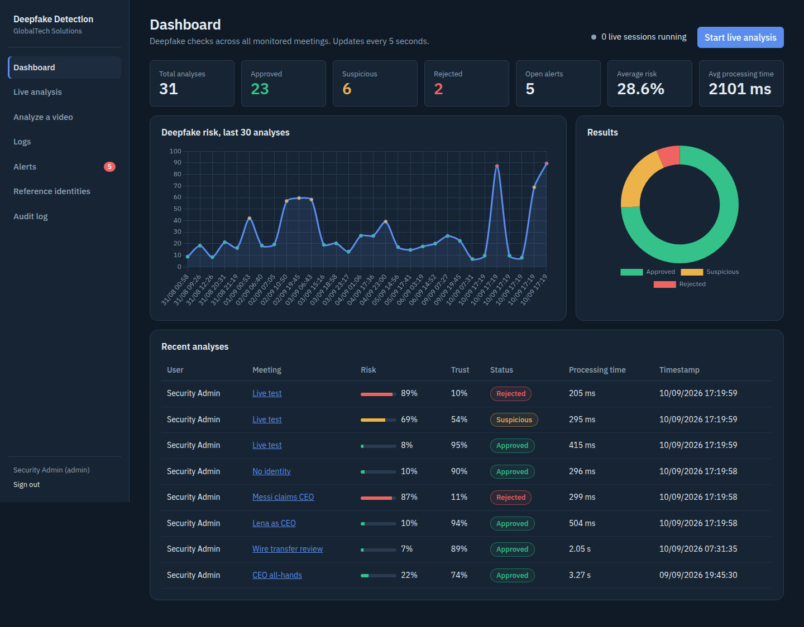
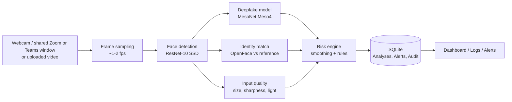

# AI-Based Deepfake Detection System for Organizational Video Meetings

An information system that helps a security team detect **deepfake impersonation** in video meetings
(Zoom, Microsoft Teams or a webcam). It analyses the participant's face, compares it with a reference
photo of the employee they claim to be, and turns the result into a **Deepfake Risk Score**, a **Trust Score**
and a decision (**Approved / Suspicious / Rejected**) - with alerts, logs and an audit trail.

> Academic prototype (final project, Cyber Security track, Ono Academic College, 2026).
> Scores are probabilities, not proof. The system supports a human decision; it does not replace one.



## The problem

Attackers can now impersonate executives in live video calls with real-time face-swap tools and ask
employees to transfer money, share confidential data or grant access. Organisations still rely on
"I recognise their face". The fictional organisation in this project, **GlobalTech Solutions**, needs a tool
that adds a technical verification layer and documents every check for investigation.

## How it works



- **Live analysis runs in the browser.** The page captures about one frame per second from the camera or from a
  shared meeting window (`getUserMedia` / `getDisplayMedia`) and posts it to the server. This works when the
  server is remote - the camera is on the user's computer, not on the server.
- **Temporal smoothing.** Decisions use a moving average of the last 5 frames, so one noisy frame
  (20%, 25%, 87%, 22%) does not raise an alert. A live session stores one analysis every 5 frames.
- **Explainable rules** (all thresholds in `config.py`):
  - risk < 31% and good identity match -> Approved; 31-69% -> Suspicious; >= 70% -> Rejected
  - identity match < 20% -> Rejected; no face, face too small, or low video quality -> never Approved
  - Trust Score = 0.6 x (100 - risk) + 0.4 x identity match, reduced when the input quality is low
- **Escalation, not auto-blocking.** A high-risk alert offers "Request verification" (call back on a known number,
  MFA, in person) - following the literature on active verification.

## Measured performance (CPU only, no GPU)

| Stage | Time per frame |
| --- | --- |
| Face detection | ~90 ms |
| Deepfake model + identity embedding | ~40-50 ms |
| Server total | ~140-150 ms |
| Browser round trip | ~160 ms |
| Time to first live score | ~2 s |
| 30-frame uploaded video (sampled) | 0.3-0.6 s |

Measured on the development machine. Every analysis stores its own timings, CPU % and RAM, so the
numbers can be reproduced on the lab server (Logs -> Export CSV).

## Features

- Sign-in with hashed passwords (Werkzeug), roles (admin / analyst), lockout after 5 failed attempts
- Dashboard with live KPIs and charts (auto-refresh), logs with search / filters / CSV export
- Video upload analysis (MP4, AVI, MOV) and live analysis of a camera or a shared meeting window
- Identity verification against reference photos (admin-managed)
- Alerts with severity (Warning / High / Critical) and a handling workflow
- Audit log of security events
- Evaluation script: confusion matrix, TPR / FPR, latency, and a compression-robustness test

## Security controls

| Threat | Control |
| --- | --- |
| Password theft | Salted hashes (`generate_password_hash`), never stored in plain text |
| Brute force | Lockout after 5 failures, identical error for unknown email and wrong password |
| CSRF | Flask-WTF tokens on every form and API call, `SameSite=Lax` cookies, logout via POST |
| XSS / clickjacking | Jinja2 auto-escaping, strict Content-Security-Policy (`'self'` only), `X-Frame-Options: DENY` |
| SQL injection | SQLAlchemy ORM with bound parameters |
| Malicious uploads | Extension allow-list, content check (must decode as video), size limit, random server-side names |
| Privacy of biometric data | Uploaded videos deleted after analysis; reference photos outside `/static`, admin-only |
| Open redirect / session fixation | `next` URL restricted to local paths; session cleared on login |
| Secrets in Git | `SECRET_KEY` in `.env` (ignored by Git); `debug` off by default |

## Installation (Windows, CMD)

Requires Python 3.8 or newer (tested on 3.8, 3.10, 3.11 and 3.14).

```bat
cd deepfake-detection-system
python -m venv venv
venv\Scripts\activate
pip install -r requirements.txt
python scripts\init_env.py
flask --app run seed-demo
python run.py
```

Open http://127.0.0.1:5000 and sign in with `admin@globaltech.com` / `Demo1234!` (change it for any shared use).

On Linux use `source venv/bin/activate` and forward slashes. To serve on a network:
`waitress-serve --host 0.0.0.0 --port 8000 --threads 8 run:app` (one process - live sessions are kept in memory).
Camera and screen capture need **HTTPS** when the site is not opened on `localhost`.

## Tests and evaluation

```bat
flask --app run doctor
pytest -v
python scripts\evaluate.py --real data\real --fake data\fake
python scripts\evaluate.py --real data\real --fake data\fake --jpeg 30 --scale 0.5
```

41 automated tests cover login, lockout, roles, protected routes, uploads, live sessions, alerts, logs,
the risk engine and the security headers.

## Project structure

```
app/
  __init__.py         application factory, security headers, error pages
  models.py           Users, ReferenceIdentities, Meetings, Analyses, Alerts, AuditLogs
  routes/             main (dashboard, logs, alerts), auth, analysis (upload + live API), identities
  services/           pipeline, faces, detector, risk engine, live sessions, records (alerts + audit)
  templates/ static/  Jinja2 pages, CSS, JS (Bootstrap, Chart.js and fonts bundled - works offline)
ml_models/            pre-trained models (see ml_models/README.md)
scripts/              evaluate.py, download_models.py, convert_mesonet.py
tests/                pytest suite
docs/                 ERD and screenshots
```

## Limitations

- **The deepfake model is small and from 2018.** MesoNet is fast on a CPU but weak on modern face-swap
  methods and on small, low-resolution faces (false positives). The model is pluggable - a stronger ONNX model
  can replace it without changing the rest of the system.
- **Identity matching uses OpenFace without face alignment.** Same-person similarity was 0.67-0.99 and a
  different person scored ~0.53 on sample images: the margin is narrow. Thresholds must be calibrated with
  real reference photos and cameras.
- Video only - synthetic voice is out of scope. SQLite and in-memory live state suit a single-server prototype.

## Future improvements

Stronger detector (EfficientNet / Xception trained on FaceForensics++, exported to ONNX), face alignment for
identity matching, active challenge-response verification, audio deepfake detection, PostgreSQL, HTTPS and
SSO integration, and a Zoom / Teams bot instead of screen sharing.

## Credits

MesoNet (Afchar et al., WIFS 2018, Apache-2.0), OpenCV DNN face detector, OpenFace (Apache-2.0),
Flask, Bootstrap (MIT), Chart.js (MIT), IBM Plex Sans (OFL).
