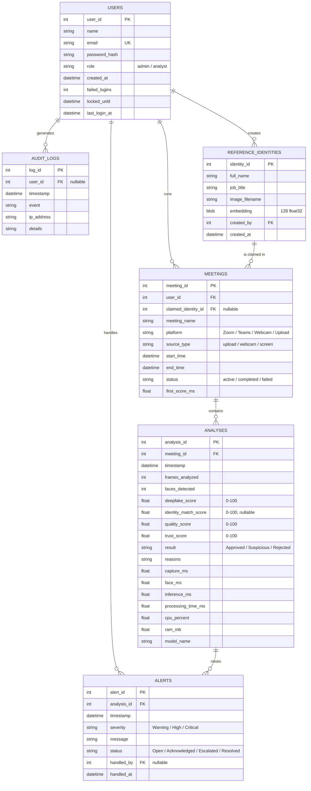

# Database design (ERD)

## How the ERD supports the system

- **Users -> Meetings (1:N).** Every monitored session belongs to the analyst who ran it, which gives accountability.
- **Meetings -> Analyses (1:N).** An uploaded video produces one analysis; a live session produces one analysis
  per window of 5 frames. This is how the system keeps a *timeline* of risk during a call (temporal analysis).
- **Analyses -> Alerts (1:N).** Alerts point to the exact evidence that raised them. The alert status and
  `handled_by` support the incident-response workflow (acknowledge, escalate for extra verification, resolve).
- **ReferenceIdentities -> Meetings (1:N).** The identity a participant claims to be; its stored face embedding is
  what the live face is compared with (identity verification requirement from the Problem Identification).
- **Latency columns** (`capture_ms`, `face_ms`, `inference_ms`, `processing_time_ms`, `first_score_ms`, CPU, RAM)
  turn the real-time requirement into measured evidence.
- **AuditLogs** record security events (sign-ins, failures, lockouts, alert handling, exports) for investigation.
- `quality_score` and `reasons` make every decision explainable: the system states *why* a result was not Approved.
